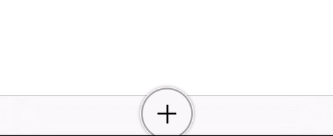

# ProgressButton [](https://github.com/Carthage/Carthage) []()



## Check it out

To run the example project, clone the repo, and open the 'Example/Example.xcodeproj' file.

## Requirements

This component is written using Swift and Dynamic Frameworks, so iOS 8.x is required. However you may want to manually import the source files into your project, if you need to support 7.x.

## Installation

ProgressButton is available through [Carthage](https://github.com/Carthage/Carthage). To install
it, simply add the following line to your Cartfile:

```ruby
github "sprint84/ProgressButton" ~> 1.0
```

###Installing Carthage

To install the `carthage` tool on your system, please download and run the `Carthage.pkg` file for the latest release, then follow the on-screen instructions.

Alternately, you can use Homebrew and install the `carthage` tool on your system simply by running brew update and `brew install carthage`.

For further details, please visit the [Carthage Github page](https://github.com/Carthage/Carthage)

##Usage

ProgressButton is intended to be used in conjunction with `UIToolbar` or `UITabBar`. By default, when instantiated this component will try to center itself within its parent view. Although possible, setting the frame of this button manually is not recommended. Using the button in a `UIToolbar` is quite simple. First you need to import the module:

```swift
import ProgressButton
```

Then instantiate the view and add it to a `UIToolbar` or `UITabBar`.

```swift
let addButton = ProgressButton()
addButton.addInView(toolbar)
```

You can normally add actions to `ProgressButton` using `addTarget:action:forControlEvents` since it is a subclass of `UIButton`. However, we added a simpler closure method if you want to keep code inline.

```swift
addButton.setAction {
    print("Action performed")
}
```

`ProgressButton` displays a progress bar around it's frame. Setting the current progress works as expected:

```swift
addButton.setProgress(self.progress, animated: true)
```

### Customization
`ProgressButton` supports some layout customizations, and we are working to improve customizable parameters in the future. For example, `ProgressButton` supports 3 color levels, that can be triggered by a threshold value.

```swift
public var normalProgressColor: UIColor
public var advisoryProgressColor: UIColor
public var warningProgressColor: UIColor 
```

Users can define when those colors will be triggered, in a range 0..1. If you set values above 1.0 for these threshold values, the progress bar will always display the `normalProgressColor`:

```swift
public var advisoryProgressThreshold: Double
public var warningProgressThreshold: Double
```

You can also change the position where the progress arc starts. The default value for the initial angle is 90° or π/2. That means the arc will begin drawing from the bottom of the circunference.

And you can change an offset angle that will be calculated from the initial angle in both directions (clockwise and counter-clockwise), creating an empty section on the initial angle position. These values must be set in Radians.

```swift
/// Starting point, in radian angles, where the progress arc will begin. Default: π/2
public var initialAngle: Double

/// Arc offset, in radian angles, from `initialAngle` where the progress arc will start drawing. Default: π/6
public var arcOffset: Double
```

## Author

Reefactor, Inc., reefactor@gmail.com

## License

ProgressButton is available under the MIT license. See the LICENSE file for more info.
